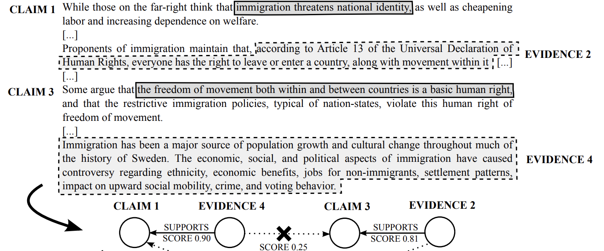
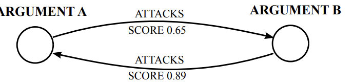

# Отчет по Argumentation Mining

## Литература
Первая работа [Argumentation Mining: State of the Art and Emerging Trends](http://lia.disi.unibo.it/~ml/publications/ACMTOIT2015.pdf)
содержит очень хороший обзор ArgMining. В ней упоминается проблема различия постановки задачи и отсутствия единой
базы определений. С этого я и начну.

### Argumentation Models
Компонента аргументации (argumentation component) - базовая единица аргументации, обычно предложение или непрерывная
часть предложения. Примеры - Claim, Evidence. Далее эти понятия будут пояснены.
Модель аргументации - это набор взаимоотношений между компонентами аргументации, которыми будет оперировать ArgMining 
система. Далее будет несколько примеров.

*Monological model* - модель, где основными компонентами является Claim
и Evidence, связанные отношением Support (поддержка). 

Альтернативно существует **Dialogical model**, где Claim и Evidence 
связаны отношением Attack.

Помимо этого существует другая классификация: abstract argumentation
и structured argumentation. Их отличия в том, что абстрактная модель
считает argument атомарной сущностью без внутренней структуры, а структурированная считает наоборот.
Monological model - structured, dialogical - abstract.

Остается вопрос: что же такое argument/argumentation/argument? В литературе считается, что связь между
выводами (утверждениями, Claim) и предпосылками (evidence) и называется argument (warrant). 
Данный опрелделения подтверждаются статьей [Introduction to structured argumentation](https://www.tandfonline.com/doi/full/10.1080/19462166.2013.869764)

### Как искать аргументацию
Везде в литературе считается, что компоненты аргументации являются неперерывной частью предложения или целым
предложением. Из этого довольно очевидно получается базовый пайплайн поиска компонент аргументации:
* Поиск аргументативного предложения (бинарная классификация).
* Определение класса компонент (возможно, уточнение их границ). Некоторые модели имеют ограничение: в одном предложении
может быть только одна компонента.

Все это делалось в работах 14-15 года с помощью классического машинного обучения над tf-idf, BOW и всеми вытекающими
из этого недостатками.

Особняком стоит IBM Debater, где ищут context dependent claim и context independent claim (об этом позже).
Определение границ компонент тоже стоит особняком, в разных работах это делается по-разному. В работах с классичеким
МО считается, что claim и evidence могут занимать несколько предложений, в IBM считают, что claim всегда содержится
внутри предложения.

Допустим, что каким-то образом были выделены компоненты агрументации. Финальный этап - построение отношений
между ними (графа).

## Литература (продолжение)
Продлжением первой обзорной статьи является [Five Years of Argument Mining: a Data-driven Analysis](https://www.ijcai.org/proceedings/2018/0766.pdf),
которая полезна новыми датасетами (часть с данными в конце).

Как уже было сказано ранее, отдельно стоит IBM с их собственными определениями. О них сейчас и пойдет речь.

### IBM
Т.к. IBM не всегда совападает само с собой, будем идти по статьям и соответственным датасетам. Все статьи и датасеты
собраны [на их сайте](https://www.research.ibm.com/haifa/dept/vst/debating_data.shtml).

[A Benchmark Dataset for Automatic Detection of Claims and
Evidence in the Context of Controversial Topics](http://acl2014.org/acl2014/W14-21/pdf/W14-2109.pdf)
Следующие определения и мои вольные переводы на русский.

Topic – a short, usually controversial statement that defines the subject of interest.
 
Context Dependent Claim (CDC) – a general concise statement that directly supports or contests the Topic.

Context Dependent Evidence (CDE) – a text segment that directly supports a CDC in the context of a given Topic.

Топик (тема) - короткое, обычно противоречивое утверждение, устанавливающее объект обсуждения.

Контекстно зависимое утверждение - краткое общее утверждение, напрямую подтверждающее или опровергающее тем.

Контекстно зависимая предпосылка - сегмент текста, который напряму поддерживает контекстно зависимое утверждение
в контексте заданной темы.

Тексты размечались руками с помощью ПО [GATE](https://gate.ac.uk).
1,392 labeled claims for 33 different topics, and 1,291 labeled evidence for 350 distinct claims in 12 different topics.
Содержит дамп статей из википедии и 2 экселевских файла. В каждом экслелевском файле есть тема и название статьи.
В одно написаны клеймы, во втором клеймы и соответствующие evidence. Я проверил пару вещей руками - клеймы и эвиденс
действительно являются кусками из исходного текста.
Никаких замеров и метрик на датасете не приводится.
Датасет лежит по пути `datasets/IBM/CE_2014`.

[Show Me Your Evidence – an Automatic Method for Context Dependent
Evidence Detection](https://www.research.ibm.com/haifa/dept/vst/papers/Evidence2015.pdf)
Работа, выпущенная через год, после предыдущей. Немного меняются определения:

Topic: a short phrase that frames the discussion.

Claim: a general, concise statement that directly supports or contests the topic.

Context Dependent Evidence (CDE): a text segment that directly supports a claim in the context of the topic.

Определения почти точь-в-точь повторяют предыдущую работу. Работа посвящена автоматическому поиску CDE.
Помимо этого вводится 3 класа Evidence:
* Study - численный результат исследования данных или текстовое заключение.
* Expert - показания данные человеком или группой лиц, у которых есть авторитет в данной области.
* Anecdotal - описание какого-либо события.

Разметка проводилась вручную, аналогично предыдущей статье.
547 Wikipedia articles associated with 58 different topics were annotated through this procedure.
Темы брались из сайта idebate.org. Вообще интересный сайт: в нем есть темы, их краткое описание и несколько тэгов: за и против утверждения.
Например тема обязательного сексуального образования в школах в качестве аргументов "за" имеет:
Сексуальное образование снизит число ЗПП; на родитей в этом вопросе нельзя положиться; даже закрытые религиозные группы
получат только добро от Sex Education.
Аргументы "против":
Родители должны решать, посещать ли их детям такие занятия; SexEd человек познает естественно вместе со взрослением
и не может выучить его за партой и т.п.

Нам этот сайт не очень подходит, но можно держать его в голове, вдруг где-нибудь понадобится.

В статье описывается бейзлайн и приводятся метрика MRR. Ни скор, ни метрика не вызывают никакого впечатления.
Датасет так же состоит из статей, клеймов и эвиденса, лежит в datasets/IBM/CE_2015.

[Will it Blend? Blending Weak and Strong Labeled Data
in a Neural Network for Argumentation Mining](https://www.aclweb.org/anthology/P18-2095.pdf)
В данной работе исследуется эффективность обучения с Weak Labeled Data, полученной автоматически при обучении нейросети.
5785 Strong Labeled примеров topic, topic concept и sentence с меткой 1, если sentence является evidence. Стоит заметить, что тут 
они сами сломали формализм, потому что по сути здесь topic == claim и судя по датасету так и есть.
Зато здесь вводится понятие topic concept - объект обсуждения. Например в теме "видеоигры вызывают насилие" topic 
concept = "видеоигры".
Для получения слаборазмеченных данных (WLD) ищутся паттерны "that + topic concept"
(пример <someone> argued that <claim>)

Базовая модель основана на LSTM, результаты улучшаются (с 72 acc до 74) при использовании WLD. Weak Labeled data, 
который 200к+ автоматически полученных предложений увы они не выпускают, но хоть методику получения описывают.
5700+ strong labeled data лежит в datasets/IBM/ES_2018.

[Towards an argumentative content search engine using weak supervision](https://www.aclweb.org/anthology/C18-1176.pdf)
Опять же статья, развивающая идею предыдущей. И опять меняются все названия.
Теперь topic concept называется main concept, маркер начала claim (который в предыдущей статье был that) теперь не один,
а их целая куча и они составляют Claim Lexicon (CL). Пример самых важных 50 слов из этого лексикона приведен в статье.

Датасет содержит почти 1.5М пар topic, sentence claim полученных таким образом.

### In progress

Argumentation Mining: The Detection, Classification and
Structuring of Arguments in Text
mochales moens

Помимо этих 4х датасетов у IBM есть еще несколько вещей, которые мне нужно досмотреть.
Что мне еще нужно дочитать

UKP Sentential Argument Mining Corpus released in (Stab et al., 2018).

Levy et al. (2017)
 Webis-Debate-16 (Al-Khatib et al., 2016)
Stab and Gurevych(2017) present one of the largest, with around 6,000 annotated positive instances). 
DART 
Support Vector Machines (SVM) [Mochales Palau and Moens 2011; Park and Cardie 2014; Stab and Gurevych 2014b; Eckle-Kohler
et al. 2015], Logistic Regression [Levy et al. 2014; Rinott et al. 2015], Na¨ıve Bayes classifiers [Mochales Palau and Moens 2011; Biran and Rambow 2011; Park and Cardie
2014; Eckle-Kohler et al. 2015], Maximum Entropy classifiers [Mochales Palau and
Moens 2011], Decision Trees and Random Forests [Stab and Gurevych 2014b; EckleKohler et al. 2015]. У всех у них нужно глянуть данные....

